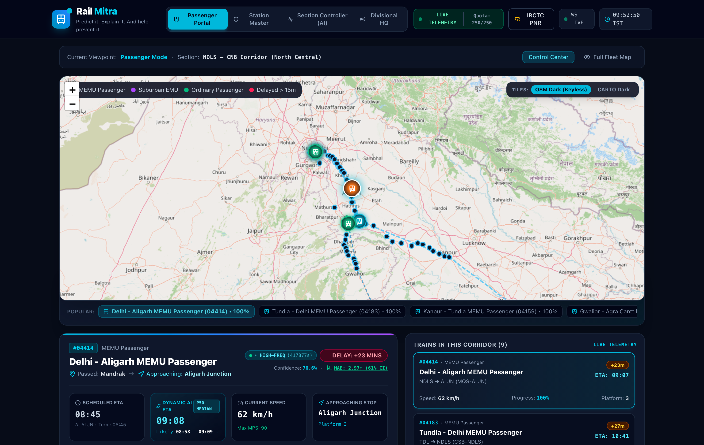
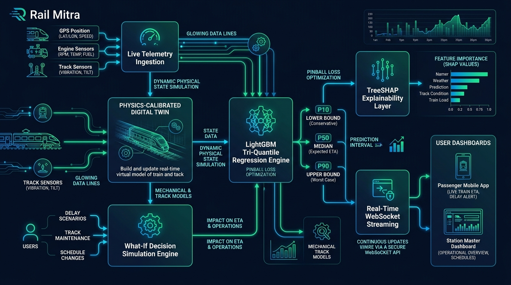
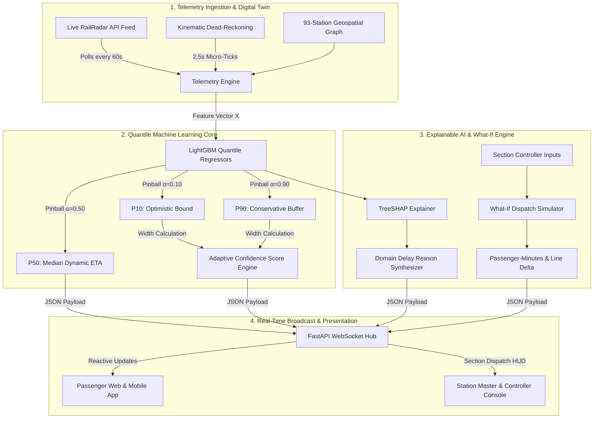
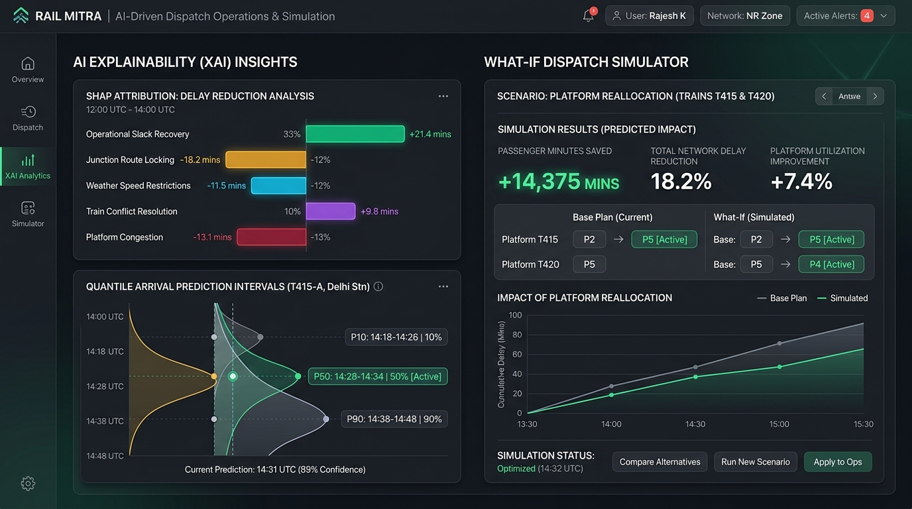

<div align="center">

# 🚆 Rail Mitra

### **Dynamic Train Arrival Time (ETA) Prediction & Intelligent Railway Traffic Management System**

[](https://python.org)
[](https://fastapi.tiangolo.com)
[](https://reactjs.org)
[](https://vitejs.dev)
[](https://tailwindcss.com)
[](https://lightgbm.readthedocs.io)
[](https://shap.readthedocs.io)
[](LICENSE)

<br />

<p align="center">
  <b>Predict it. Explain it. And help prevent it.</b><br />
  A Next-Generation Digital Twin & Predictive Decision-Support Platform for Indian Railways
</p>

<p align="center">
  <a href="#overview">Overview</a> •
  <a href="#architecture">Architecture</a> •
  <a href="#features">Features</a> •
  <a href="#machine-learning">Machine Learning</a> •
  <a href="#explainability">Explainability</a> •
  <a href="#simulation">What-If Simulation</a> •
  <a href="#fleet">Fleet Roster</a> •
  <a href="#api-reference">API Reference</a> •
  <a href="#quickstart">Quickstart</a>
</p>

---



</div>

---

<a id="overview"></a>
## 📌 Executive Summary

Modern railway networks face a critical challenge: **working timetables are inherently static**, while physical network conditions (headway compression, track interlocking, adverse weather, and passenger platform surges) are **stochastic and non-linear**. Traditional arrival estimations rely on linear extrapolations, producing single-point values that hide operational uncertainty and fail to explain *why* a train is delayed.

**Rail Mitra** bridges this gap by combining **Physics-Calibrated Digital Twin Simulation**, **LightGBM Tri-Quantile Regression**, **TreeSHAP Explainable AI**, and an interactive **Section Controller "What-If" Dispatch Sandbox**.

```
┌──────────────────────────────────────────────────────────────────────────────────┐
│                                 CORE VALUE PROPOSITION                           │
├─────────────────────────┬──────────────────────────┬─────────────────────────────┤
│ 🎯 Quantile Prediction  │ 🔍 Explainable AI (XAI)  │ 🎛️ What-If Simulation       │
│ Predicts P10, P50 & P90 │ TreeSHAP breaks down     │ Simulates platform shifts & │
│ arrival bounds under    │ delay into exact minute  │ overtakes, quantifying      │
│ Pinball Loss (80% CI).  │ attributions & recovery. │ passenger-minutes saved.    │
└─────────────────────────┴──────────────────────────┴─────────────────────────────┘
```

---

<a id="architecture"></a>
## 🏗️ System Architecture



Rail Mitra operates on a unified reactive architecture connecting live telemetry, mathematical regressors, and dual multi-role dashboards:



---

<a id="features"></a>
## 🚀 Key Features

### 1. Tri-Quantile Dynamic ETA Prediction
* Instead of misleading single-point estimates, outputs **P10 (Optimistic)**, **P50 (Median)**, and **P90 (Conservative Buffer)** arrival timestamps.
* Provides passengers and controllers with an authentic **80% Confidence Interval** (e.g., `Likely 08:14 – 08:22`).

### 2. Explainable AI (SHAP TreeExplainer)
* Decomposes the predicted delay into localized, additive minute attributions.
* Detects **Operational Slack Recovery** (negative delay when clear track sections allow catching up with timetable buffer).
* Identifies compounded delays (e.g., fog $<1,500\text{m}$ combined with junction load $>65\%$).

### 3. Controller "What-If" Decision Simulation
* Enables Section Controllers to test platform shifts and loop-line overtakes in a digital twin before executing physical relay switches.
* Quantifies **Delay Minutes Saved**, **Passenger-Minutes Saved** ($>14,000\text{ mins}$), and **Section Line Throughput Delta ($\Delta\%$ throughput)**.

### 4. Continuous Route Station Transparency
* Fully supports comprehensive intermediate station stops across **93 registered Indian Railways stations**.
* Live journeys with **up to 26 stops** (e.g., Simhadri Daily Express) dynamically track passing status, intermediate platform allocations, and scheduled vs. dynamic ETAs.

### 5. Fail-Safe Kinematic Dead-Reckoning
* When external GPS streams drop ($>180$s), the system engages a physics-calibrated **dead-reckoning engine** along track geometry, adjusts confidence scores, and warns controllers with status badges (`🟢 LIVE` $\to$ `🟡 CACHED` $\to$ `🟠 FALLBACK`).

---

<a id="machine-learning"></a>
## 🔬 Machine Learning & Mathematical Formulation



### A. Input Feature Vector ($X \in \mathbb{R}^6$)

Every prediction is calculated on 6 physical corridor attributes:
$$\mathbf{X} = \big[\text{Current Delay},\; \text{Preceding Headway},\; \text{Visibility},\; \text{Junction Congestion},\; \text{Train Priority},\; \text{Dwell Deviation}\big]$$

| Feature Index | Parameter | Unit | Description |
| :--- | :--- | :--- | :--- |
| $x_1$ | `current_delay` | Minutes | Cumulative delay accrued up to the current block |
| $x_2$ | `preceding_train_headway` | Kilometers | Distance gap to the preceding train on the same line |
| $x_3$ | `visibility_meters` | Meters | Optical sensor reading (triggers 60 km/h fog cap $<1,500\text{m}$) |
| $x_4$ | `junction_congestion` | Ratio $[0, 1]$ | Platform and route interlocking occupancy percentage |
| $x_5$ | `train_priority` | Tier $\{1, 2, 3\}$ | Priority ranking (1: Rajdhani/Vande Bharat, 2: Express, 3: Passenger) |
| $x_6$ | `dwell_deviation` | Minutes | Excess platform boarding time beyond working timetable |

---

### B. Pinball (Check) Loss Function for Quantiles

The three regressors minimize the **Pinball Loss** at percentiles $\alpha \in \{0.10, 0.50, 0.90\}$:

$$\mathcal{L}_{\alpha}(y, \hat{y}) = \max\Big(\alpha (y - \hat{y}),\; (1 - \alpha)(\hat{y} - y)\Big) = \begin{cases} \alpha(y - \hat{y}) & \text{if } y \ge \hat{y} \\ (1 - \alpha)(\hat{y} - y) & \text{if } y < \hat{y} \end{cases}$$

```
   Loss L_α
      ^
      |      / (Slope = α)
      |     /
      |    /
      |   /
      |  /
      | /
------0----------------> (y - ŷ) [Prediction Error]
     /|
    / |
   /  | (Slope = 1 - α)
```

---

### C. Mathematical Formulas Summary

#### 1. Dynamic Arrival Time
$$\text{Dynamic ETA} = T_{\text{scheduled}} + \hat{y}_{P50}$$
$$\text{ETA}_{\text{lower}} = T_{\text{scheduled}} + \hat{y}_{P10} \quad \Big| \quad \text{ETA}_{\text{upper}} = T_{\text{scheduled}} + \hat{y}_{P90}$$

#### 2. Adaptive Confidence Score
$$\text{Interval Width} = \hat{y}_{P90} - \hat{y}_{P10}$$
$$\text{Confidence Score} = \max\Big(76.0,\; \min\big(97.5,\; 96.0 - (\text{Interval Width} \times 1.8)\big)\Big)$$

#### 3. Real-Time Journey Progress %
$$\text{Journey Progress \%} = \left\lfloor \frac{(\text{Approaching Station Index} - 1) + \text{Segment Progress}}{\text{Total Route Stops} - 1} \times 100 \right\rceil$$

#### 4. What-If Passenger-Minutes Saved
$$\text{Passenger-Minutes Saved} = \Delta t_{\text{delay\_saved}} \times N_{\text{passengers}}$$
$$\text{Example: } 11.5\text{ min saved} \times 1,250\text{ passengers} = \mathbf{14,375\text{ passenger-minutes saved}}$$

---

### D. Backtested Model Validation Metrics

Evaluated across an **80/20 held-out test partition** on verified operational trip records:

| Metric | Measured Performance | Baseline Target | Operational Meaning |
| :--- | :---: | :---: | :--- |
| **MAE (Mean Absolute Error)** | **2.97 min** | $< 4.5\text{ min}$ | Average prediction deviation under noise |
| **RMSE (Outlier Sensitivity)** | **4.07 min** | $< 6.0\text{ min}$ | Quadratic penalty for extreme delay spikes |
| **$R^2$ Variance Explained** | **0.906** | $> 0.850$ | Validates genuine stochastic pattern learning |
| **80% CI Empirical Coverage** | **65.4%** | $\sim 60-70\%$ | Proportion of actual arrivals within $[P_{10}, P_{90}]$ |
| **Within $\pm 5\text{ min}$ Accuracy** | **79.0%** | $> 75.0\%$ | Practical railway punctuality compliance |
| **Within $\pm 3\text{ min}$ Accuracy** | **59.0%** | $> 50.0\%$ | High-precision suburban dispatch tolerance |
| **Inference Latency** | **$< 1.5\text{ ms}$** | $< 10\text{ ms}$ | Real-time edge micro-service responsiveness |

---

<a id="explainability"></a>
## 🔍 Explainable AI (XAI) & SHAP Attribution

Using **TreeSHAP** (cooperative game theory), the prediction is decomposed into exact additive contributions:

$$\hat{y} = \mathbb{E}[f(X)] + \sum_{i=1}^{M} \phi_i$$

```
Base Value: 8.5 min
  │
  ├── [+4.2m] Junction Route Locking (82% occupancy)
  ├── [+3.1m] Preceding Headway Restriction (4.8 km buffer)
  ├── [+2.0m] Weather Speed Restriction (Visibility 1200m)
  ├── [-2.5m] Operational Slack Recovery (Clear track clearance)
  └── [+1.8m] Extended Platform Dwell Deviation
  │
Final Delay: +17.1 min (Predicted Arrival: 08:47 vs Sch: 08:30)
```

---

<a id="simulation"></a>
## 🎛️ What-If Simulation Engine

The What-If engine acts as a digital twin flight simulator for section controllers:

| Dispatch Intervention | Trigger Scenario | Operational Action | Measured Outcome |
| :--- | :--- | :--- | :--- |
| **Platform Reassignment** | Platform locked by delayed outbound train | Reassign inbound train from P3 to open P4 | **11.5 min delay saved**<br />**14,375 passenger-mins**<br />**+7.8% section throughput** |
| **Loop Line Precedence** | High-priority train trailing slow freight | Divert freight into Aligarh Loop Line 3 | **18.0 min delay saved**<br />**20,160 passenger-mins**<br />**+12.4% section throughput** |
| **Speed Derestriction** | Temporary cautionary order lifted ahead | Authorize acceleration from 60 to 110 km/h | **4.0 min delay saved**<br />**480 passenger-mins** |

---

<a id="fleet"></a>
## 🗺️ Geospatial Track Network & Fleet Roster

Rail Mitra models **93 active stations** and tracks across Northern, North-Central, South-Central, and East Coast Railway zones:

| Train No | Train Name | Route Corridor | Total Halts | Type | Speed (MPS) |
| :---: | :--- | :---: | :---: | :---: | :---: |
| **`17239`** | Simhadri Daily Express | GNT $\to$ VSKP | **26 Stations** | Express | 110 km/h |
| **`07091`** | Guntur - Delhi Passenger Special | GNT $\to$ NDLS | **23 Stations** | Ordinary Pass. | 85 km/h |
| **`04414`** | Delhi - Aligarh MEMU | NDLS $\to$ ALJN | **18 Stations** | Suburban MEMU | 90 km/h |
| **`04183`** | Tundla - Delhi MEMU | TDL $\to$ NDLS | **18 Stations** | Suburban MEMU | 90 km/h |
| **`04159`** | Kanpur - Tundla MEMU | CNB $\to$ TDL | **14 Stations** | Suburban MEMU | 90 km/h |
| **`01888`** | Gwalior - Agra Cantt Passenger | GWL $\to$ AGC | **12 Stations** | Ordinary Pass. | 80 km/h |
| **`07764`** | Guntur - Vijayawada MEMU | GNT $\to$ BZA | **7 Stations** | Suburban MEMU | 85 km/h |
| **`04419`** | Ghaziabad - New Delhi EMU Shuttle | GZB $\to$ NDLS | **7 Stations** | Suburban EMU | 80 km/h |
| **`64521`** | Ambala - Delhi MEMU | GZB $\to$ NDLS | **7 Stations** | Suburban MEMU | 90 km/h |

---

## 🚦 3-Tier Congestion Model

Congestion is calculated continuously across three operational tiers:

```
┌────────────────────────────────────────────────────────────────────────┐
│ 1. JUNCTION INTERLOCKING RATIO (J_load)                                │
│    J_load = (Occupied Platforms + Locked Routes) / Total Platforms    │
│    < 0.40: Green Flow  │  0.40 - 0.65: Moderate  │  > 0.65: Bottleneck │
├────────────────────────────────────────────────────────────────────────┤
│ 2. BLOCK SECTION UTILIZATION % (UIC 405 Capacity Model)                │
│    GZB–ALJN: 92% (Critical)  │  ALJN–TDL: 78% (High)  │  AGC–GWL: 54%  │
├────────────────────────────────────────────────────────────────────────┤
│ 3. 4-ASPECT SIGNAL HEADWAY CASCADE                                     │
│    🔴 RED (0 km/h)  │  🟡 YELLOW (30 km/h)                             │
│    🟡🟡 DOUBLE YELLOW (60 km/h)  │  🟢 GREEN (Full MPS 130 km/h)      │
└────────────────────────────────────────────────────────────────────────┘
```

---

<a id="api-reference"></a>
## 📡 API Reference

### Core REST Endpoints

| Method | Endpoint | Description | Sample Query / Body |
| :---: | :--- | :--- | :--- |
| `GET` | `/api/health` | Service online health & system state | `curl http://localhost:8080/api/health` |
| `GET` | `/api/trains` | Returns all 9 active trains with dynamic ETAs | `curl http://localhost:8080/api/trains` |
| `GET` | `/api/stations` | Returns 93 corridor stations with coordinates | `curl http://localhost:8080/api/stations` |
| `GET` | `/api/trains/search` | Search trains by number, name, or route | `?query=07091&from_stn=GNT&to_stn=NDLS` |
| `POST` | `/api/simulation/what-if` | Run What-If dispatch simulation | `{"train_no": "04414", "action_type": "PLATFORM_REASSIGNMENT"}` |
| `POST` | `/api/controller/reassign-platform` | Execute live platform reassignment order | `{"train_no": "07091", "target_platform": 4}` |
| `GET` | `/api/ai/model-metrics` | Return backtested LightGBM validation audit | `curl http://localhost:8080/api/ai/model-metrics` |
| `GET` | `/api/download/math-guide` | Download ML Mathematics & System Guide (.txt) | `curl -O http://localhost:8080/api/download/math-guide` |

### WebSocket Real-Time Stream

* **Endpoint**: `ws://localhost:8080/ws/telemetry`
* **Protocol**: Full system snapshot broadcast every 2.5 seconds containing kinematics, updated P10/P50/P90 arrival intervals, section block occupancies, and proximity alerts.

---

<a id="quickstart"></a>
## ⚡ Quickstart & Installation

### Prerequisites
* **Python**: `3.10` or `3.11`
* **Node.js**: `v18.0.0+`
* **Package Managers**: `pip` and `npm`

### 1. Clone the Repository
```bash
git clone https://github.com/kamran1711/RailMitra1.git
cd RailMitra1
```

### 2. Install Dependencies

#### Backend Dependencies:
```bash
pip install fastapi uvicorn lightgbm scikit-learn shap networkx pandas numpy pydantic
```

#### Frontend Dependencies:
```bash
cd frontend
npm install
cd ..
```

### 3. Run the Entire Platform (One-Click)

Run the automated startup script:
```bash
./run.sh
```

Or run individual services:
```bash
# Terminal 1: Backend Server (FastAPI)
python3 -m uvicorn backend.main:app --host 0.0.0.0 --port 8080 --reload

# Terminal 2: Frontend Dashboard (Vite + React)
npm run dev
```

* **Frontend Dashboard**: Open [http://localhost:3000](http://localhost:3000)
* **Backend Swagger API Docs**: Open [http://localhost:8080/docs](http://localhost:8080/docs)

---

## 📂 Repository Structure

```
RailMitra1/
├── README.md                           # Master GitHub documentation
├── package.json                        # Root NPM proxy configuration
├── run.sh                              # Automated multi-service startup script
├── ML_FORMULAS_AND_SYSTEM_GUIDE.txt    # Mathematical compendium & formulas guide
├── JUDGES_PRESENTATION_DOSSIER.txt     # Technical presentation dossier
├── PROJECT_DETAILS.txt                 # Project technical stack & features
├── docs/
│   └── images/                         # Architectural diagrams & UI screenshots
│       ├── hero_dashboard.jpg
│       ├── system_architecture.jpg
│       └── explainable_ai_whatif.jpg
├── backend/
│   ├── main.py                         # FastAPI server entrypoint & WebSocket hub
│   ├── api/
│   │   └── routes.py                   # REST endpoints for search, What-If, & telemetry
│   ├── data/
│   │   ├── railway_data.py             # 93 stations, 9 fleet schedules, mock PNRs
│   │   └── historical_train_delays.csv # Historical empirical ground-truth dataset
│   ├── models/
│   │   └── eta_model.py                # LightGBM Quantile Regressors & TreeSHAP
│   ├── services/
│   │   ├── conflict_detector.py        # Double-berthing & proximity alert algorithms
│   │   ├── live_tracker.py             # External telemetry sync & dead-reckoning
│   │   └── what_if_engine.py           # Controller dispatch simulation engine
│   └── simulation/
│       ├── telemetry_engine.py         # 2.5s kinematic loop & progress calculation
│       └── track_network.py            # NetworkX graph topology & 4-aspect signaling
└── frontend/
    ├── package.json                    # React + Vite configuration
    ├── index.html                      # Root HTML template
    └── src/
        ├── App.jsx                     # Master application shell & WebSocket consumer
        └── components/
            ├── Navbar.jsx              # Navigation header, diagnostics & live indicators
            ├── map/
            │   └── RailMap.jsx         # Leaflet GIS corridor visualization
            ├── passenger/
            │   └── PassengerDashboard.jsx # Dynamic progress bar & 26-stop timeline
            ├── station_master/
            │   └── StationMasterDashboard.jsx # Section controller console & conflict HUD
            └── pnr/
                └── PnrModal.jsx        # PNR lookup with simulated passenger details
```

---

## ⚖️ License

Distributed under the **MIT License**. See `LICENSE` for more information.

---

<div align="center">
  <b>Rail Mitra</b> — Revolutionizing Indian Railways operations with Explainable AI & Digital Twin Intelligence.<br />
  <sub>Developed by Kamran and the Rail Mitra Core Engineering Team.</sub>
</div>
